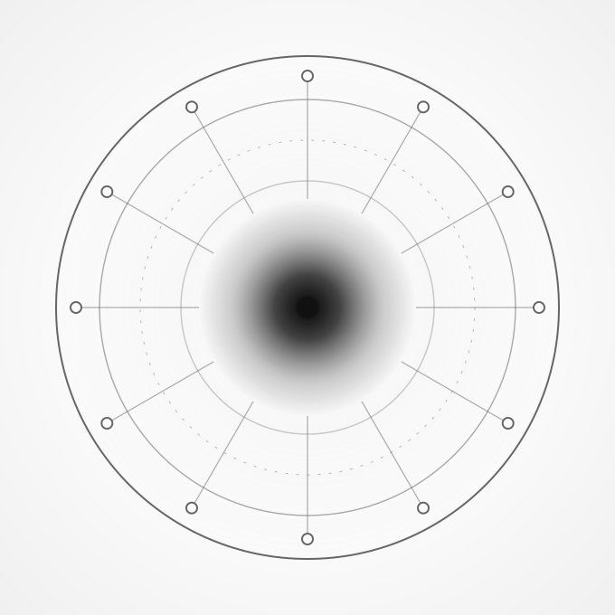

<!--
SPDX-FileCopyrightText: 2026 The IndustryFlow contributors

SPDX-License-Identifier: CC-BY-SA-4.0
-->

# IndustryFlow

**Real-time industrial IoT platform for sensor-data processing, anomaly detection, and predictive maintenance.**

<table>
<tr>
<td width="300">
  <picture>
    <source media="(prefers-color-scheme: dark)" srcset="img/industryflow-logo-mono-dark.svg" />
    
  </picture>
</td>
<td>

IndustryFlow ingests high-velocity sensor streams, processes them through Kafka and Spark into
TimescaleDB, detects anomalies with ML models, and surfaces real-time alerts — with a full
Prometheus / Grafana / Loki observability stack. It is multi-tenant by design (schema-per-tenant
isolation) and is the platform that the [IndustryGrow](https://github.com/IIchukissII/IndustryGrow)
cultivation project is built on.

Where IndustryGrow is the **tree**, IndustryFlow is the **ground it grows from** — the gateway
core at the centre, where every sensor stream converges.

</td>
</tr>
</table>

## Features

- **Real-time stream processing** — Kafka + Apache Spark
- **Multi-tenant** — schema-per-tenant isolation
- **ML-powered anomaly detection** — XGBoost and ensemble models
- **Time-series storage** — TimescaleDB
- **Configurable alerting** — threshold and ML-based rules
- **Full observability** — Prometheus, Grafana, Loki

## Quick start

```bash
git clone https://github.com/IIchukissII/industryflow
cd industryflow
cp .env.example .env        # configure secrets and ports
docker-compose up -d
curl http://localhost:8000/health
```

The full setup, configuration, API examples, testing, and troubleshooting walkthrough lives in
**[docs/getting-started.md](docs/getting-started.md)**.

## Documentation

Full index: **[docs/](docs/README.md)**.

- **[Getting Started & Operations](docs/getting-started.md)** — setup, configuration, API, testing, troubleshooting
- **[Operations](docs/operations/)** — [authentication](docs/operations/authentication.md) · [user management](docs/operations/user-management.md) · [monitoring](docs/operations/monitoring.md)
- **[Architecture](docs/architecture/README.md)** — database, Spark streaming, ML, alerting, feature engineering
- **[API Reference](docs/api/README.md)** — per-service API documentation
- **[Architecture Decision Records](ADR/)** — the *why* behind the platform's design

Interactive API docs are served at `http://localhost:8000/docs` when the stack is running.

## Technology

Python 3.11 · FastAPI · Apache Spark 3.5 · Apache Kafka · MLflow · PostgreSQL 15 + TimescaleDB ·
Redis · MinIO · React 18 · Prometheus / Grafana / Loki.

## Contributing

1. Branch from `main`.
2. Make changes following the existing code style (Python: PEP 8 via `black` / `flake8`).
3. Record architectural decisions as ADRs (see [ADR/ADR-0000](ADR/ADR-0000-decision-records-and-source-of-truth.md)).
4. Add tests and update the relevant docs.
5. Open a pull request.

## License

[AGPL-3.0-or-later](LICENSE) © 2026 The IndustryFlow contributors
